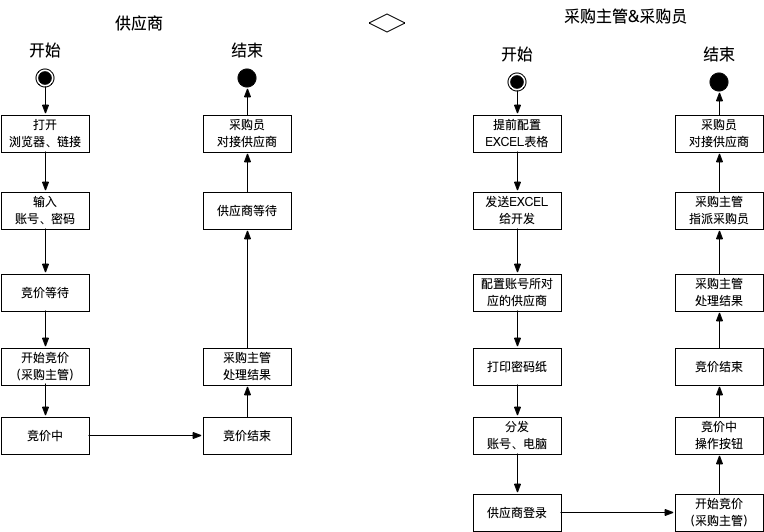

#竞标系统2.0
## 需求说明
某一天需求方Mr.luo 找到我们产品说要做个在线竞标系统

###项目大致流程

##技术实现
### 使用技术
SpringBoot+Netty+MySQL

###总体描述
* 从技术架构实现层面来说，系统可分为SpringBoot和Netty两个层面
* 从网络连接状态来说可以分为长连接(Netty部分)和短连接(http部分)
* 从业务端来说可以分为两个端，一个是供应商端和管理端
